# Voter Registration

Read the [voter overview](voter-guide.md) to understand why to register as a voter.

## Prerequisites for registration

1. Registration is supported via each of the following:&#x20;
   * [Daedalus Mainnet](https://daedaluswallet.io/en/download/) (desktop, Ledger Nano S and X, Trezor T)
   * [Yoroi mobile](https://yoroi-wallet.com/#/) (iOS and Android, Ledger Nano S)
   * [Yoroi browser extension](https://yoroi-wallet.com/#/) (desktop, Ledger Nano S and X)
   * [AdaLite-Ledger](https://adalite.medium.com/catalyst-voting-registration-on-adalite-71d975f75755) (desktop, hardware wallet, no mobile support)
   * [AdaLite-Trezor](https://adalite.medium.com/catalyst-voting-registration-on-adalite-71d975f75755) (desktop, hardware wallet, no mobile support)
   * [Adalite-Mnemonics](https://adalite.medium.com/catalyst-voting-registration-on-adalite-71d975f75755) (desktop, software wallet)
   * [Hardware wallet via CLI interface](https://github.com/vacuumlabs/cardano-hw-cli#catalyst-voting-registration) + [Guide](https://github.com/gitmachtl/scripts/blob/master/SPO\_Pledge\_Catalyst\_Registration.md#how-to-vote-with-funds-also-pledge-on-hardware-wallets-new)
   * [VotingTools CLI](https://github.com/input-output-hk/voting-tools)
2. _Minimum requirement of 500 ADA_ \*excluding rewards\*
3. Prior to registration, you must install the latest version of the Catalyst Voting application on your mobile device (version 0.1.13) _Please note that **iPhone 6 and before** are not supported._ **- Android users**: [Download “Catalyst Voting” from the Google Play store.](https://play.google.com/store/apps/details?id=io.iohk.vitvoting) - **IOS users**: [Download “Catalyst Voting” from the IOS store.](https://apps.apple.com/fr/app/catalyst-voting/id1517473397?l=en)
4. Registration _must be completed_ before snapshot da
5. Note: there is a registration fee of 0.17 -0.18 ADA

## Registration

* IMPORTANT: If you registered in Fund4 and/or Fund5 and were able to cast votes - your registration will be automatically valid for Fund6 voting round! Provided you still have your QR and PIN code. Don't need to re-register. This does not apply to Fund2 or Fund3 registrations. Your voting power, however, will be updated during the new snapshot relevant for Fund6.
* For Fund6, only voter registration is open at the moment. You will get the QR and PIN code from the wallet you use to register.&#x20;
* Regardless of your wallet, each registration will provide you with a unique QR and PIN code. These must absolutely be saved. _No QR code saved, no vote! No PIN code saved, no vote!_
* The Catalyst Voting application is used for voting, which is not active until October. There will be additional updates to the Catalyst Voting application prior.
* Download the latest version of the Catalyst Voting application on your mobile device (version 0.1.13)
* In the latest version of Daedalus, navigate to the voting registration page from the menu on the left-hand side. Confirm that you have installed the Catalyst Voting app, by ticking the checkbox and click on "Register to vote":

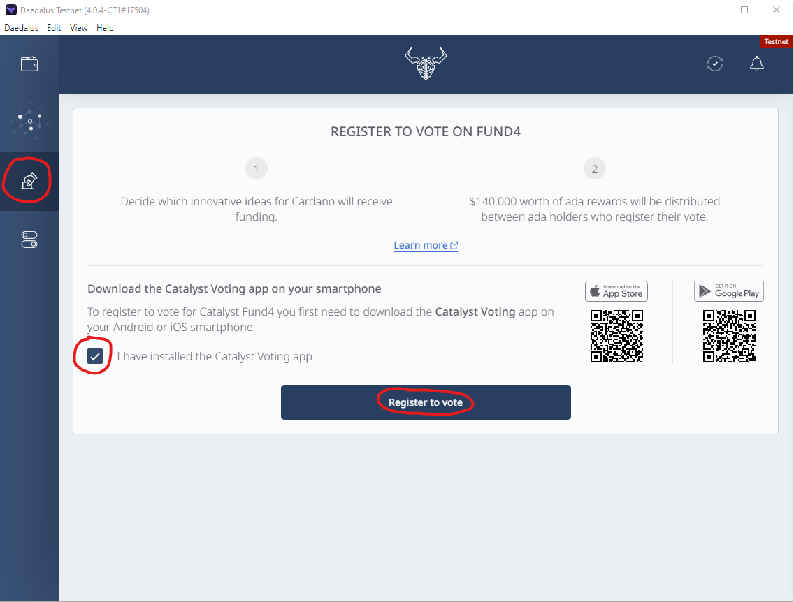

1. Select the wallet you wish to vote with and click "Continue" **(ensure the wallet contains the minimum required amount for voting: 500 ADA \*excluding rewards\*)**

_Note: This amount must remain in this wallet until the snapshot, which will collect your voting power. Dates and times of the snapshots for each Fund will be announced through our official social and communication channels_

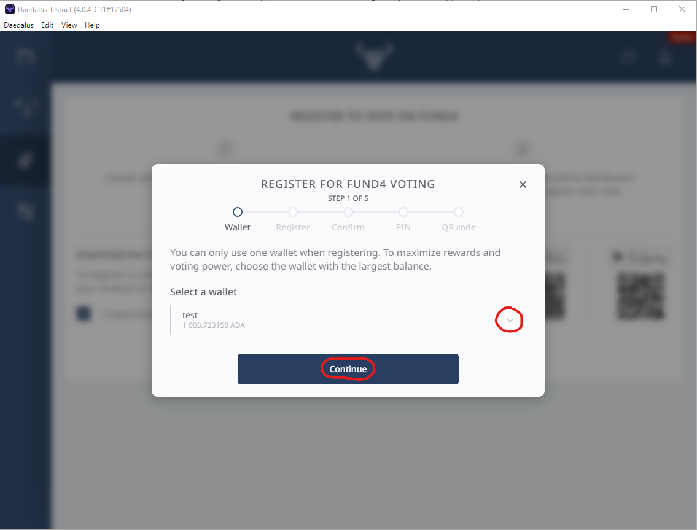

1. Enter the spending password for your wallet and click "Submit registration transaction":

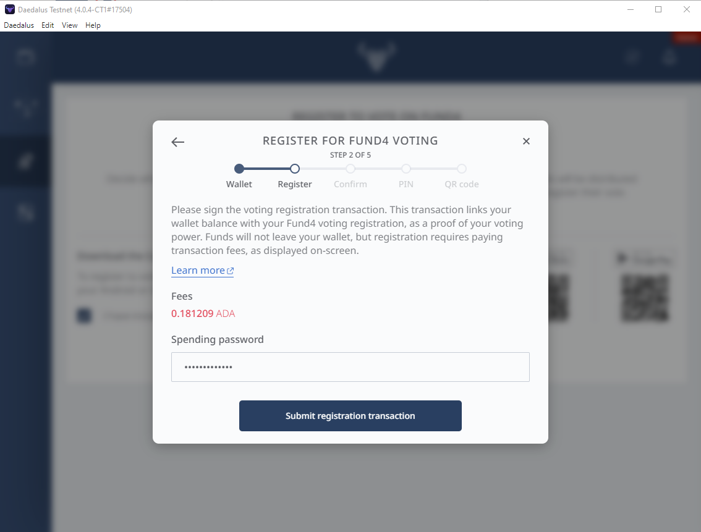

1. Wait for approximately 5 min. until the transaction is confirmed by the blockchain and click "Continue". Do not close Daedalus during this time, otherwise your registration will be cancelled and you will need to start over:

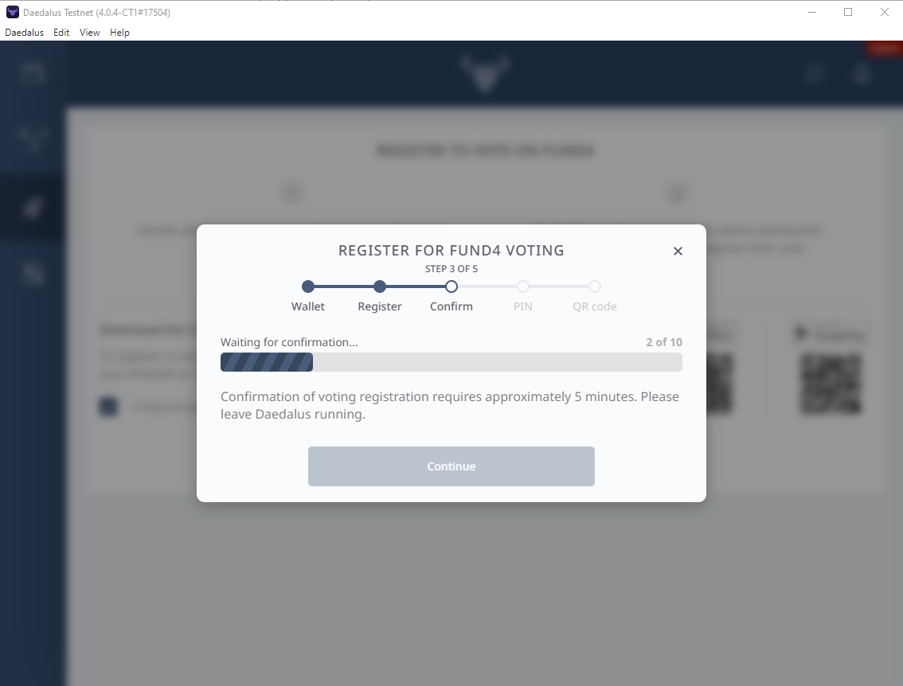

1. Select a 4 digit PIN code of your choice, confirm it and click "Continue". Please make sure to remember it or write it down as you will need it for voting later on. Note that if you lose the PIN you will not be able to vote and you will need to repeat the registration process to select a new PIN:

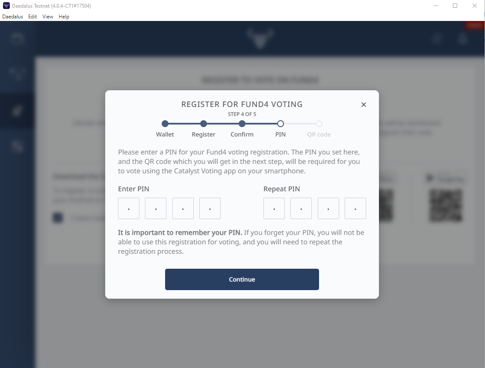

1. Your QR code will be generated. Make sure you save the QR code - you can take a screenshot of it or save it as a PDF file. Note that the QR code is not saved anywhere and if you lose the QR code you will not be able to vote. You will need to repeat the registration process to obtain a new QR. Confirm that you understand this by ticking both checkboxes and click "Close":

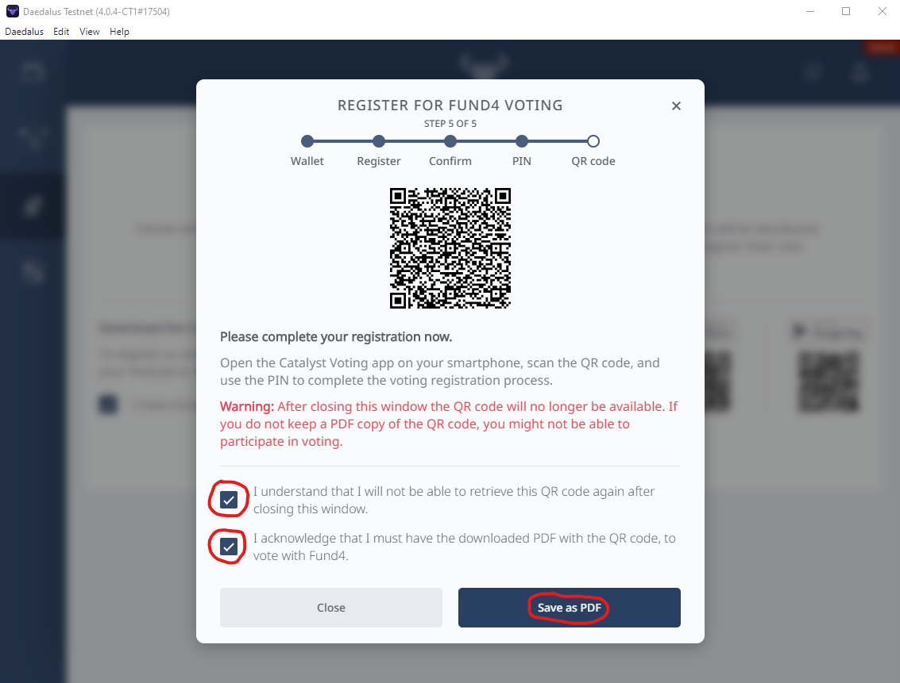

1. Open the Catalyst Voting app on your mobile device and tap "Let's start" or "Skip":

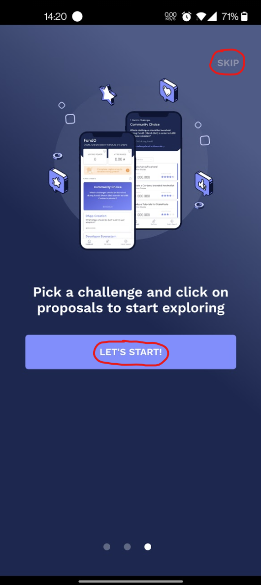

1. Next - tap on "Complete registration to receive voting power":

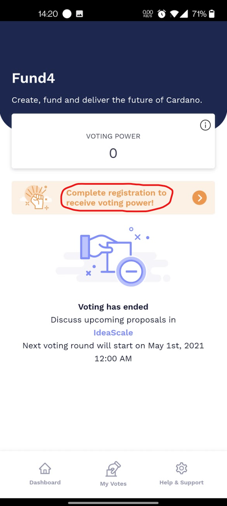

1. Next - tap on "Scan voting QR code" and scan the QR code, which you received in Step 7.

.png>)

1. Enter the 4 digit PIN code, which you set in Step 6 and tap "Decrypt and set access code". This concludes the registration process.

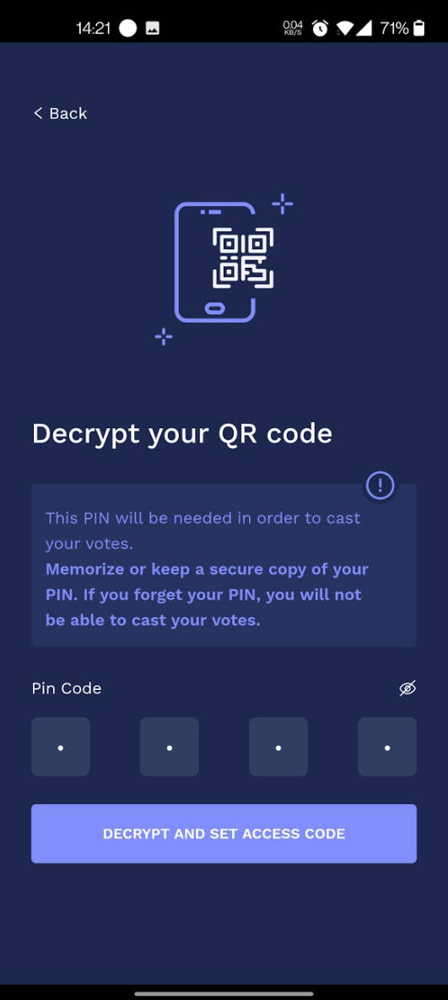

## Voting

1. Now you need to wait until the voting starts. When the voting starts you will see your voting power, corresponding to the amount of ADA, which you had in your wallet at the time of the snapshot. In our case the voting power will be 1003.

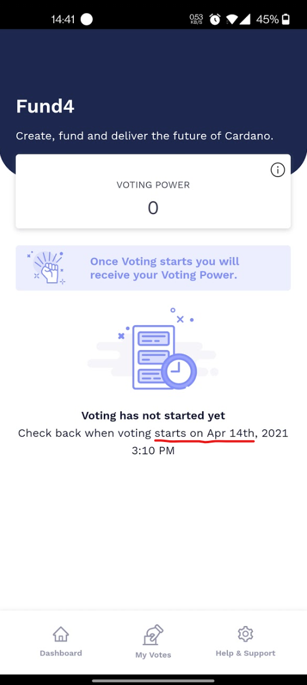

1. Voting starts and you receive your voting power. Please allow up to 10 min for loading. While you wait you can go through the challenges:

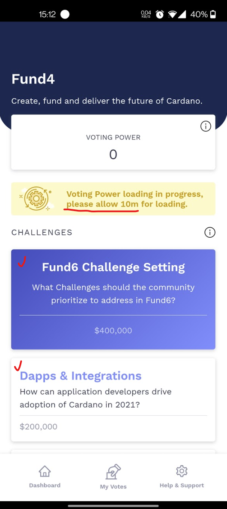

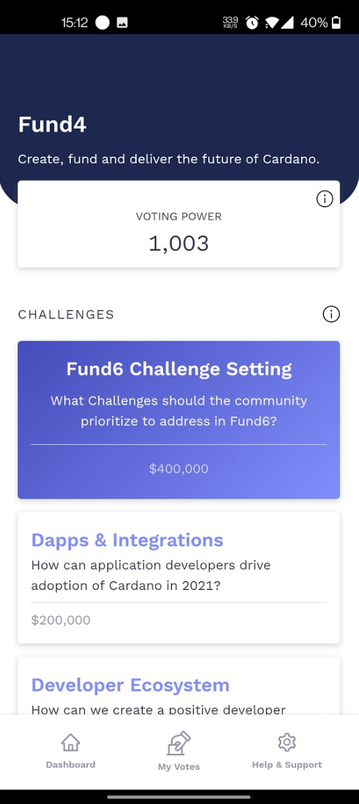

1. Read through the different proposals and place your vote (Yes or No). You can vote for a single proposal, for several proposals or for all proposals - it is up to you. You can review and change your votes at any time in the "My Votes" section. The number of votes will not impact the amount of your reward, same if you do not vote at all.

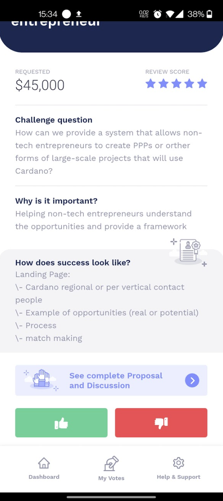

1. After each vote, the Catalyst Voting app will remind you that your votes have not been submitted yet.

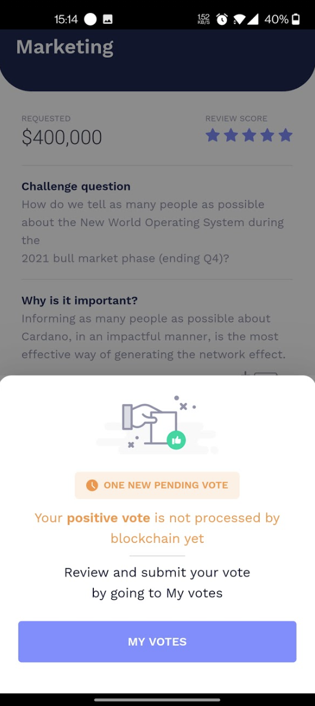

1. When you are ready to submit your votes, go to the "My Votes" section and tap "Cast my votes"

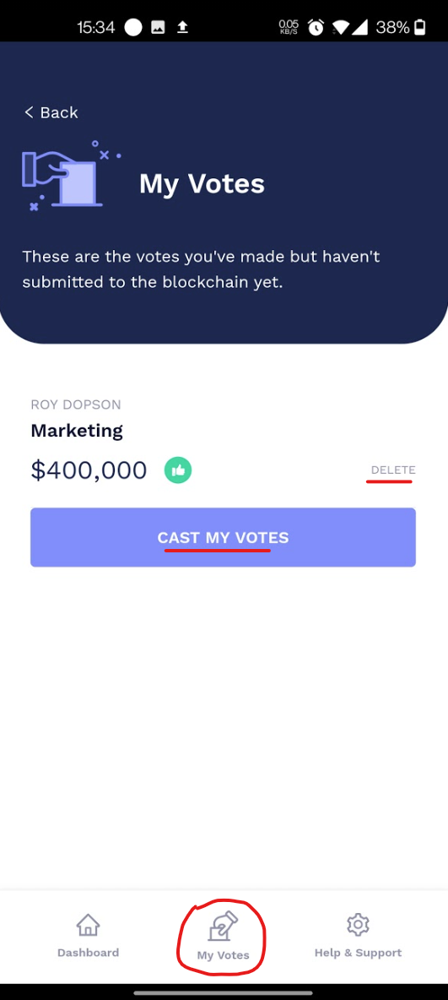

1. Enter your PIN (you selected it in Step 6) to authorize the votes and tap "Confirm"

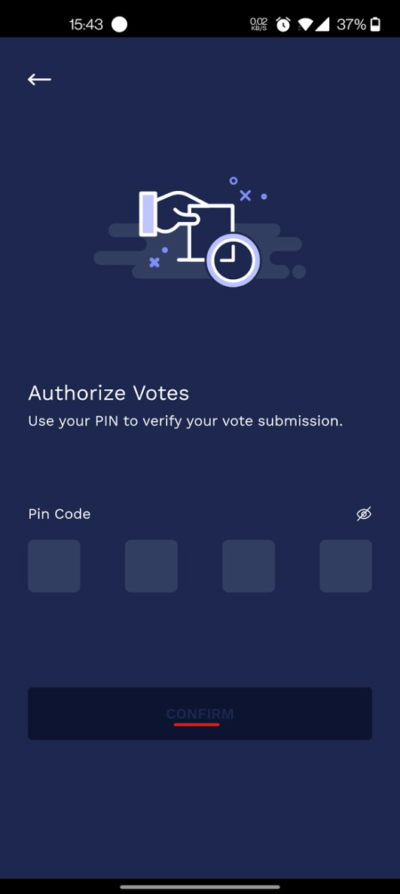

1. You will see a confirmation message saying that your votes have now been submitted to the blockchain. This concludes the voting process.

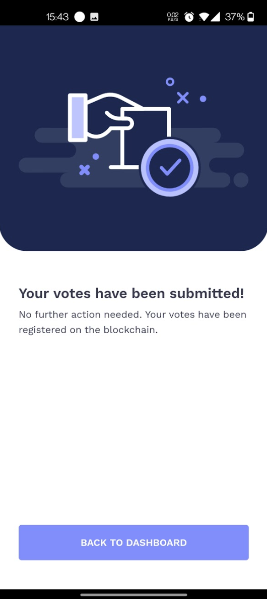

_Note: You can vote again, while the voting round is running. Every next vote will overwrite the previous, which means only the last vote is valid. Proposals you already visited will not have a blue border on the right side:_

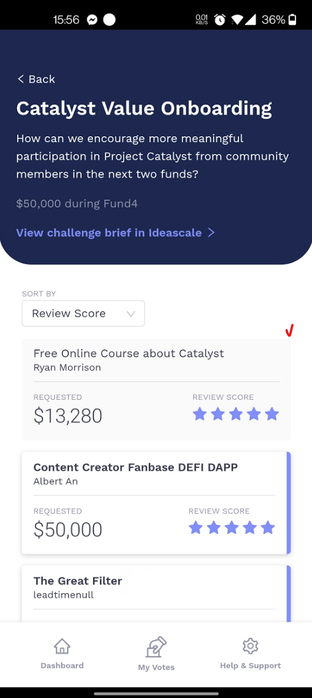

## How to report potential issues & bugs

If you registered using Daedalus, submit a support request from the Catalyst Voting application.

If you registered using Yoroi, submit a request here: [https://yoroi-wallet.com/#/support](https://yoroi-wallet.com/#/support)

If you registered via AdaLite: submit a request via email to [adalite@vacuumlabs.com](mailto:adalite@vacuumlabs.com)

## **Resources**

* [iOS Catalyst App](https://apps.apple.com/app/id1517473397)
* [Android Catalyst App](https://play.google.com/store/apps/details?id=io.iohk.vitvoting)
* [Registration and voting guide](https://iohk.zendesk.com/hc/en-us/articles/900005679386)
* [All you need to know - Fund 6 Voting](https://www.reddit.com/r/cardano/comments/p2xpi8/project\_catalyst\_all\_you\_need\_to\_know\_fund6\_voter/)
* [Fund 3 rewards calculation](https://docs.google.com/document/d/1Z2qLzGbLQxLgfDKqnTZFTL3IM28V8uUykptng0p5jbE/edit)
* [Catalyst fund voting reward examples](https://docs.google.com/document/d/1Z2qLzGbLQxLgfDKqnTZFTL3IM28V8uUykptng0p5jbE/edit)

**Community resources**


The following resources are not maintained by IOHK but have been used by the community, please be careful of scams


* [Stake pool operator voting registration](https://github.com/gitmachtl/scripts/blob/master/SPO\_Pledge\_Catalyst\_Registration.md)
